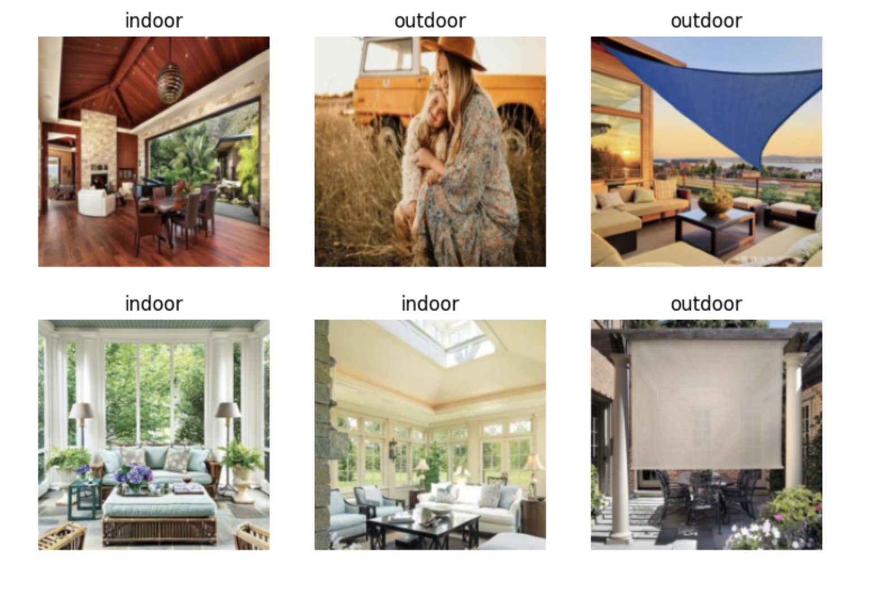

# Image Clasification

After study the lectur and the Python Jupyter Notebook of "Is it a bird" by Jeremy Howard, I modify and teach it to seperate between indoor and outdoor images.

### Program execuation screenshot
